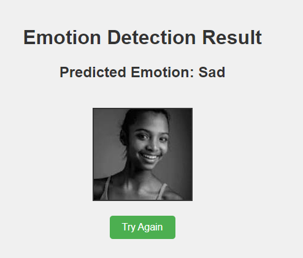

## HumanEmotionDetection
A full fledged application that detects human emotion from an Image.
In this project, I have finetuned Efficient model to achieve 80% accuracy on the validation dataset.

This project uses human emotions dataset from Kaggle to finetune efficientnet model

The application is created using flask framework and deployed on AWS EC2 instance . The docker image was pushed to ECR and pulled into EC2 instance using Github actions as a part of CI/CD pipeline implementation

I tried using TransferNet approach and Finetuning approach. With Transfernet, the model accuracy was only 63% while it increased to 80% with a finetuned model

## Evaluation Metrics

Loss: 0.5
Accuracy: 80%
Top_k_accuracy: 93%

